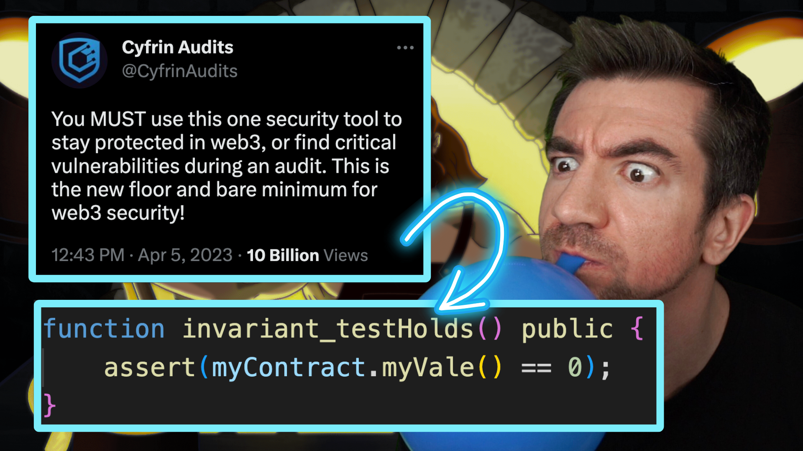
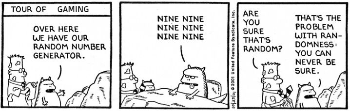
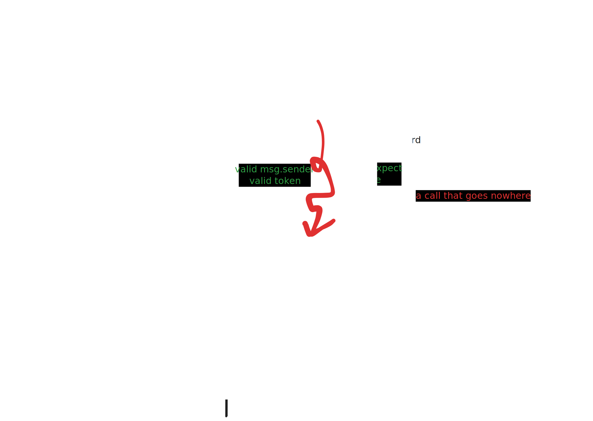

# Invariants

- [Invariants](#invariants)
- [Videos](#videos)
- [Levels to test invariants](#levels-to-test-invariants)
  - [1. Stateless fuzzing - Open](#1-stateless-fuzzing---open)
    - [Written Example](#written-example)
    - [Code Example](#code-example)
    - [Pros \& Cons](#pros--cons)
  - [2. Stateful fuzzing - Open](#2-stateful-fuzzing---open)
    - [Written Example](#written-example-1)
    - [Code Example](#code-example-1)
    - [Pros \& Cons](#pros--cons-1)
  - [3. Stateful Fuzzing - Handler](#3-stateful-fuzzing---handler)
    - [Written Example](#written-example-2)
    - [Code Example](#code-example-2)
    - [Pros \& Cons](#pros--cons-2)
    - [Image of Handler fuzzing vs Open fuzzing](#image-of-handler-fuzzing-vs-open-fuzzing)
  - [4. Formal Verification](#4-formal-verification)
    - [FV TL;DR](#fv-tldr)
    - [Written Example](#written-example-3)
    - [SAT Solver](#sat-solver)
    - [Code Example](#code-example-3)
    - [Pros \& Cons](#pros--cons-3)
- [Resources](#resources)

You can watch our minial videos on Formal Verification, Invariants, and Fuzz testing here.

# Videos 

<br/>
<table>
  <tr>
    <th align="center">Invariants & Fuzzing</th>
    <th align="center">Invariants & Formal Verification</th>
  </tr>
  <tr>
    <td align="center">
      <a href="https://www.youtube.com/watch?v=juyY-CTolac&t=193s" target="_blank">
        
      </a>
    </td>
    <td align="center">
      <a href="https://www.youtube.com/watch?v=izpoxfTSaFs" target="_blank">
        
      </a>
    </td>
  </tr>
</table>
<br/>

Invariants are properties of a program or system that must always remain true. 

For example:
- For an ERC20 token, the sum of user balances MUST always be less than or equal to the total supply. 
- In the [Aave](https://aave.com/) protocol, it MUST always have more value in collateral than value in loans. 

All systems usually have at least one kind of invariant. Even ERC20/ERC721 tokens have invariants. Some examples are documented in the [Trail of Bits Properties repo.](https://github.com/crytic/properties)

With this in mind, if we understand the core invariant of a system, we can write tests to test specifically for that invariant. 

# Levels to test invariants

We are looking at 4 levels at assessing testing breaking invariants in smart contracts.

1. Stateless fuzzing 
2. Open Stateful fuzzing
3. Handler Stateful fuzzing
4. Formal Verification

They range from least -> most work, and least -> most confidence. In this folder, we have a number of different examples of what each of these may look like. 

## 1. Stateless fuzzing - Open

Stateless fuzzing (often known as just "fuzzing") is when you provide random data to a function to get some invariant or property to break. 

It is "stateless" because after every fuzz run, it resets the state, or it starts over. 

### Written Example
You can think of it like testing what methods pop a balloon. 
1. Fuzz run 1:
   1. Get a new balloon
      1. Do 1 thing to try to pop it (ie: punch it, kick it, drop it)
      2. Record whether or not it is popped
2. Fuzz run 2:
   1. Get a new balloon
      1. Do 1 thing to try to pop it (ie: punch it, kick it, drop it)
      2. Record whether or not it is popped
3. *Repeat...* 

### Code Example

<details>
<summary>See example</summary>

```javascript
// myContract
    // Invariant: This function should never return 0
    function doMath(uint128 myNumber) public pure returns (uint256) {
        if (myNumber == 2) {
            return 0;
        }
        return 1;
    }

// Fuzz test that will (likely) catch the invariant break
    function testFuzzPassesEasyInvariant(uint128 randomNumber) public view {
        assert(myContract.doMath(randomNumber) != 0);
    }
```

</details>

### Pros & Cons

Pros:
- Fast to write
- Fast to test

Cons:
- It's stateless, so if a property is broken by calling different functions, it won't find the issue 
- You can never be 100% sure it works, as it's random input


*Source: https://www.pokecommunity.com/showthread.php?t=379445*

## 2. Stateful fuzzing - Open

Stateful fuzzing is when you provide random data to your system, and for 1 fuzz run your system starts from the resulting state of the previous input data.

Or more simply, you keep doing random stuff to *the same* contract.

### Written Example
You can think of it like testing what methods pop a balloon. 
1. Fuzz run 1:
   1. Get a new balloon
      1. Do 1 thing to try to pop it (ie: punch it, kick it, drop it)
      2. Record whether or not it is popped
   2. If not popped
      1. Try a different thing to pop it (ie: punch it, kick it, drop it)
      2. Record whether or not it is popped
   3. If not popped... *repeat for a certain number of times*
2. Fuzz run 2:
   1. Get a new balloon
      1. Do 1 thing to try to pop it (ie: punch it, kick it, drop it)
      2. Record whether or not it is popped
   2. If not popped
      1. Try a different thing to pop it (ie: punch it, kick it, drop it)
      2. Record whether or not it is popped
   3. If not popped... *repeat for a certain number of times*
3. *Repeat*

You can see the difference here, is we didn't get a new balloon every single "fuzz run". In **stateful fuzzing** we try many things to the same balloon before moving on. 

### Code Example

<details>
<summary>See example</summary>

```javascript
// myContract
    uint256 public myValue = 1;
    uint256 public storedValue = 100;
    // Invariant: This function should never return 0
    function doMoreMathAgain(uint128 myNumber) public returns (uint256) {
        uint256 response = (uint256(myNumber) / 1) + myValue;
        storedValue = response;
        return response;
    }
    function changeValue(uint256 newValue) public {
        myValue = newValue;
    }

// Test
    // Setup
    function setUp() public {
        sfc = new StatefulFuzzCatches();
        targetContract(address(sfc));
    }

    // Stateful fuzz that will (likely) catch the invariant break
    function statefulFuzz_testMathDoesntReturnZero() public view {
        assert(sfc.storedValue() != 0);
    }
```

</details>

### Pros & Cons

Pros:
- Fast to write (not as fast as stateless fuzzing)
- Can find bugs that are from calling functions in a specific order.

Cons:
- You can run into "path explosion" where there are too many possible paths, and the fuzzer finds nothing 
- You can never be 100% sure it works, as it's random input


## 3. Stateful Fuzzing - Handler

Handler based stateful fuzzing is the same as Open stateful fuzzing, except we restrict the number of "random" things we can do. 

If we have too many options, we may never randomly come across something that will actually break our invariant. So we restrict our random inputs to a set of specfic random actions that can be called. 


### Written Example
You can think of it like testing what methods pop a balloon. 

We've decided that we only want to test for dropping & kicking the balloon. 

1. Fuzz run 1:
   1. Get a new balloon
      1. Do 1 thing to try to pop it (drop it or kick it)
      2. Record whether or not it is popped
   2. If not popped
      1. Try a different thing to pop it (drop it or kick it)
      2. Record whether or not it is popped
   3. If not popped... *repeat for a certain number of times*
2. Fuzz run 2:
   1. Get a new balloon
      1. Do 1 thing to try to pop it (drop it or kick it)
      2. Record whether or not it is popped
   2. If not popped
      1. Try a different thing to pop it (drop it or kick it)
      2. Record whether or not it is popped
   3. If not popped... *repeat for a certain number of times*
3. *Repeat*

### Code Example 

This takes MUCH more work to set up in foundry, look at [../../test/invariant-break/HandlerStatefulFuzz](../../test/invariant-break/HandlerStatefulFuzz) folder for a full example.

### Pros & Cons

Pros:
- Can find bugs that are from calling functions in a specific order.
- Restricts the "path explosion" problem where there are too many possible paths, so the fuzzer is more likely to find issues

Cons:
- Much longer to write correctly
- It's easier to restrict too much so that you miss potential bugs

### Image of Handler fuzzing vs Open fuzzing



## 4. Formal Verification

Formal verification is the process of mathematically proving that a program does a specific thing, or proving it doesn't do a specific thing. 

For invariants, it would be great to prove our programs always exert our invariant. 

One of the most popular ways to do Formal Verification is through [Symbolic Execution](https://ethereum.stackexchange.com/questions/145411/is-the-solidity-built-in-smt-checker-a-form-of-symbolic-execution). Symbolic Execution is a means of analyzing a program to determine what inputs cause each part of a program to execute. It will convert the program to a symbolic expression (hence its name) to figure this out.

### FV TL;DR

The summary of FV is:

"It converts your functions to math, and then tries to prove some property on that math. Math can be proved. Math can be solved. Functions can not (unless they are transformed into math)."

### Written Example

For example, take this function:

```javascript
function f(uint256 y) public {
  uint256 z = y * 2;
  if (z == 12) {
    revert();
  } 
}
```

If we wanted to prove there is an input for function `f` such that it would never revert, we'd convert this to a mathematical expression, like such:

```javascript
z == 12 && // if z == 12, the program reverts
y >= 0 && y < type(uint256).max && // y is a uint256, so it must be within the uint256 range
z >= 0 && z < type(uint256).max && // z is also a uint256
z == y * 2; // our math
```

*The above language is known as SMTLib, a domain specific language for Symbolic Execution.*

In this example, we have a set of 4 boolean expressions. 

### SAT Solver

We can then take this set of logical expressions and dump them into a [SAT Solver](https://en.wikipedia.org/wiki/Boolean_satisfiability_problem) (A SAT Solver is not symbolic execution, but right now is a popular next step). Which for now, you can think of as a black box that takes boolean expressions and tries to find an example that "satisfies" the set. For our example above, we are looking for a input y that enables the rest of the booleans to be true. 

To dump this into a SAT solver, we need to convert our math to [CNF form](https://en.wikipedia.org/wiki/Conjunctive_normal_form) which might look something like this:

```
(z <= 12 OR y < 0 OR z < 0) AND (z >= 12 OR y < 0 OR z < 0) AND (z <= 12 OR y < 0 OR z > 2y) AND (z >= 12 OR y < 0 OR z > 2y) AND (z <= 12 OR y >= 0 OR z < 0) AND (z >= 12 OR y >= 0 OR z < 0) AND (z <= 12 OR y >= 0 OR z > 2y) AND (z >= 12 OR y >= 0 OR z > 2y)
```

Our SAT solver will then attempt to find a contradiction in our set of booleans, by randomly setting booleans to true / false, and seeing if the rest of the equation holds. 

It's different from a fuzzer, as a fuzzer tries inputs for `y`. Whereas a SAT Solver will try different inputs for the booleans.  

### Code Example

You can view [../../test/invariant-break/formal-verification/HalmosTest.t.sol](../../test/invariant-break/formal-verification/HalmosTest.t.sol) for a full example. 

### Pros & Cons

Pros:
- Can be 100% sure that a property is true/false

Cons:
- Can be hard to set up
- Doesn't work in a lot of scenarios (like when there are too many paths)
- Tools can be slow to run 
- Can give you a false sense of security that there are no bugs. FV can only protect against 1 specific property! 

# Resources

- [ToB properties](https://github.com/crytic/properties): Fuzz tests based on properties of ERC20, ERC721, ERC4626, and other token standards.
- [Example list of properties](https://github.com/crytic/properties/blob/main/PROPERTIES.md#erc20)
- [Invariant/Stateful fuzz tests](https://book.getfoundry.sh/forge/invariant-testing)
- [Handler based testing using WETH](https://mirror.xyz/horsefacts.eth/Jex2YVaO65dda6zEyfM_-DXlXhOWCAoSpOx5PLocYgw)